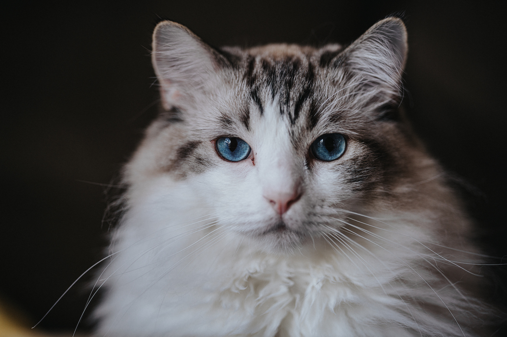

# Deploying a Tensorflow Model with Flask



## Installation 

* download miniconda installer and make it executable
```
sudo wget -c https://repo.anaconda.com/miniconda/Miniconda3-latest-Linux-x86_64.sh
sudo chmod +x Miniconda3-latest-Linux-x86_64.sh
```
* install miniconda, and source your `.bashrc` file
```
./Miniconda3-latest-Linux-x86_64.sh 
source /users/<XXX>/.bashrc
```
* create a new environment with flask, tensorflow, and pillow :  

```
conda create -n dlflask python=3.7 tensorflow flask pillow
conda activate dlflask
```

At the moment, later versions of python lead to incompatibilities 
between tensorflow and flask

* install flast-restful with pip 
(since this package is not available in conda) : 

```
pip install flask-restful
```

## Predict a cat

```
python predict_resnet50.py cat.jpg
```

Of course, you can try with a picture of yours.


## Start the app server

```
python rest_api_predict.py
```

And send a request with an image (note the @):

```
curl localhost:5000/image -F file=@cat.jpg
```

Gives : 

```
{
    "top_categories": [
        [
            "tiger_cat",
            0.5858142375946045
        ],
        [
            "Egyptian_cat",
            0.21068987250328064
        ],
        [
            "tabby",
            0.14554421603679657
        ],
        [
            "pillow",
            0.008319859392940998
        ],
        [
            "lynx",
            0.006789662875235081
        ]
    ]
}
```